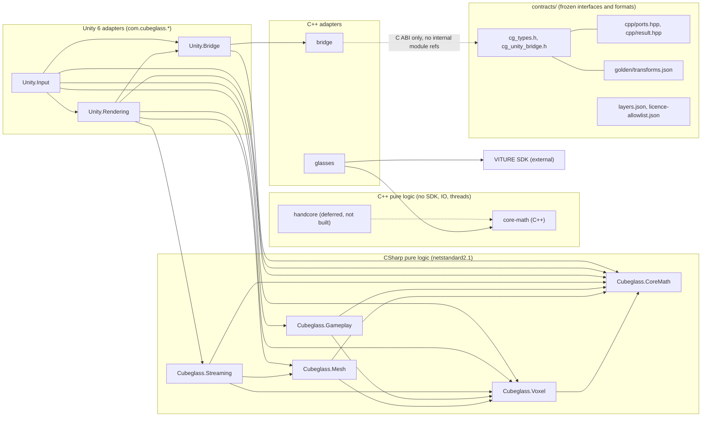
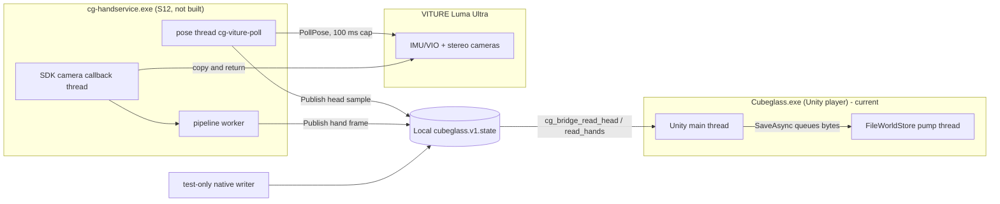
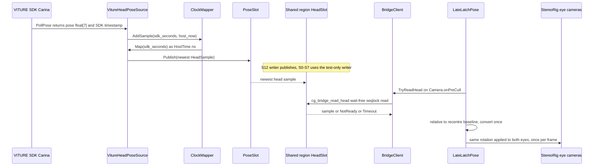
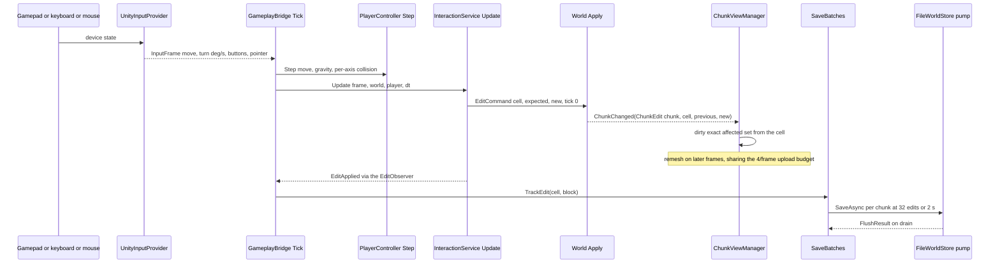
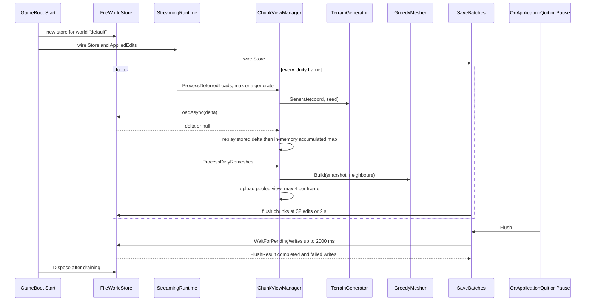
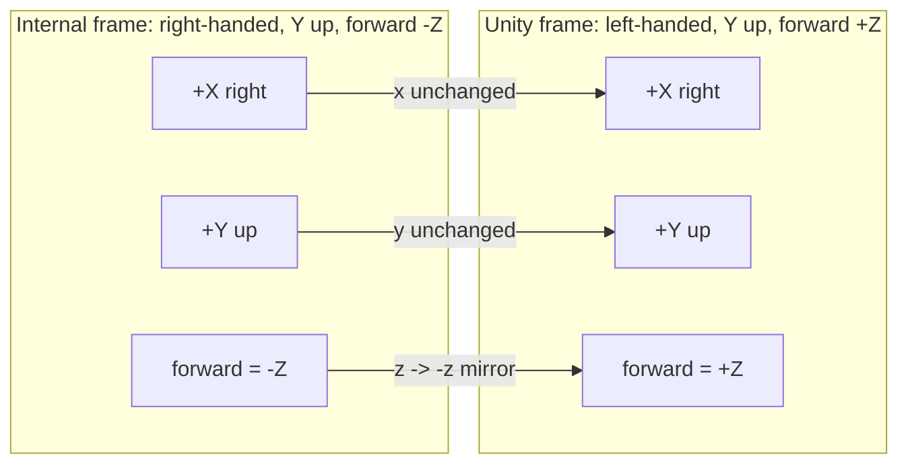
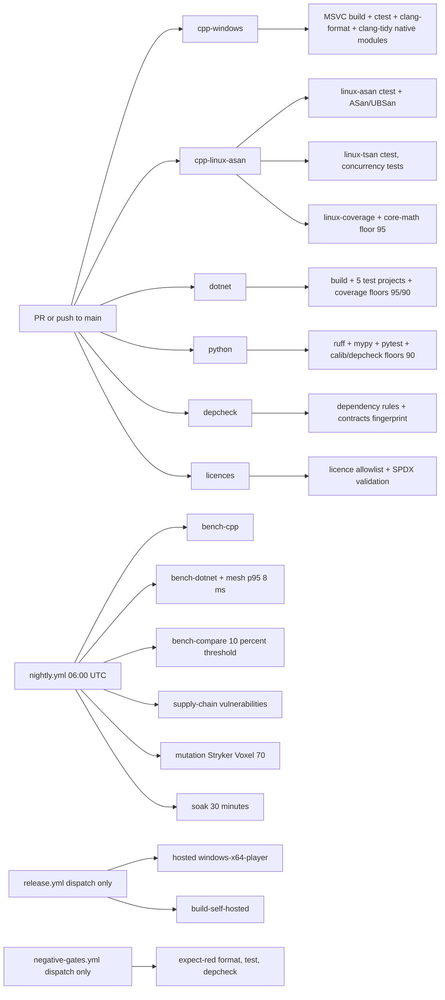

# Cubeglass Architecture

- **Snapshot:** repository `minecraft-vr`, `main` at `0d3ecb6` (2026-10-04),
  as checked out on branch `docs/full-docs`.
- **Binding specification:** `Cubeglass_Engineering_Dossier.md` (baseline v1.0,
  2026-10-01). The dossier's rule of precedence is contracts > stage specs >
  everything else.
- **Scope:** the implemented system and the reasoning behind it. Where the
  dossier and the implementation differ, the implementation is documented and
  the difference is called out explicitly (see the "implementation notes"
  below and in each section).
- **Diagrams:** all diagrams are valid mermaid v10+ (`graph LR` and
  `sequenceDiagram`), with simple ASCII node ids and no HTML in labels.

Everything below is derived from the repository: the dossier, `docs/adr/0000..0012`,
`docs/ci.md`, the stage gate notes under `docs/notes/`, the programme review
`docs/reviews/2026-10-03-full-review.md`, the tech-debt register
`docs/notes/tech-debt.md`, and the actual source trees under `contracts/`,
`cpp/`, `dotnet/src/`, `unity/Cubeglass/Packages/`, `.github/workflows/` and
`scripts/`.

---

## 1. What Cubeglass is

Cubeglass is a Minecraft-like voxel sandbox rendered in stereo to VITURE Luma
Ultra glasses connected to a Windows PC. The player looks around with 3DoF head
orientation, walks with a gamepad or keyboard, and breaks and places blocks
with a targeted block. Hand tracking from the glasses' side stereo cameras is
the planned final input, with blocks carried in the hands. The binding product
definition is dossier section 1: functional requirements FR-01..FR-09 and
non-functional targets NFR-01..NFR-07.

### 1.1 Target hardware and interfaces

| Item | Fact (dossier section 2.1, verified by the owner) |
| --- | --- |
| Device | VITURE Luma Ultra, a "Carina" device (F-02) |
| SDK | C SDK with Windows desktop support (F-01) |
| Pose | `xr_device_provider_get_gl_pose_carina`, polled on a dedicated background thread; layout `[px,py,pz,qw,qx,qy,qz]`, OpenGL convention x right, y up, z backward (F-02) |
| DOF mode | 3DoF selected with `xr_device_provider_set_dof_type_carina(handle, 0)` after create and before initialize; default 6DoF; mode changes need a full stop/destroy/recreate (F-03) |
| Recentre | `xr_device_provider_reset_origin_carina(handle, float* pose)`: position and yaw take the given pose, pitch and roll stay gravity-anchored (F-04) |
| Callbacks | pose 25 Hz, vsync, IMU, stereo cameras; timestamps are monotonic seconds (double) (F-05) |
| Stereo cameras | 8-bit grayscale, 25 Hz; buffers valid only during the callback (F-06) |
| Display | side-by-side 3840x1080 at 60 Hz or 90 Hz; 120 Hz modes are 2D only (F-09) |
| Intrinsics | the SDK header exposes no camera intrinsics, extrinsics or FOV (F-10) |

The unverified unknowns U-01..U-09 in dossier section 2.2 are owned by stages
S5-S11; the ones that gate the current software (U-01 pose behaviour in 3DoF,
U-08 display switching, U-09 distortion/FOV) remain **pending HIL** in
ADR-0009/ADR-0010.

### 1.2 Milestone state (software complete, stage tags withheld)

| Stage | Software | Stage tag |
| --- | --- | --- |
| S0-S4 (foundation, core math, voxel, meshing, gameplay) | complete (`docs/notes/s0-gate.md`..`s4-gate.md`) | `stage-0-complete` .. `stage-4-complete` (S0 recorded the controller tag action) |
| S5 glasses adapter and head pose | software complete (`docs/notes/s5-gate.md`) | **withheld** pending S5 HIL (TD-042) |
| S6 stereo renderer and Unity adapters | software complete (`docs/notes/s6-gate.md`) | **withheld** pending S6 HIL and U-09 (TD-043) |
| S7 playable 3DoF vertical slice (M1) | software complete (`docs/notes/s7-gate.md`) | **withheld** pending S7 HIL (TD-044) |
| `v0.1.0` release candidate | player build path exists; local build reproduced | **tag withheld** until the HIL playtest and a green CI player build (R50, `docs/releases/v0.1.0.md`) |
| S8-S14 (stereo capture through hand pipeline and release) | not started; `cg-handcore` is listed under `deferred` in `contracts/layers.json` | — |

The S7 software gate recorded: Unity EditMode 112/112 and PlayMode 44/44,
`ci-local -SkipUnity` all lanes pass (471 .NET tests, 45 Python tests, cpp 5/5),
and the committed game scene holding the 90 Hz budget (`docs/notes/s7-gate.md`
sections 1, 6, 8). The release routes and their current state are in section 7.

**Implementation notes vs the dossier.**

- The dossier component inventory (section 3.2) names `cg-handcore`,
  `cg-infer`, `cg-handservice`, `cg-recorder` and `cg-calib`. None of those
  exist in the tree yet; the implemented C++ modules are `cpp/core-math`,
  `cpp/glasses` and `cpp/bridge`. `cpp/bridge` is an addition not named in the
  dossier component list, and `dotnet/src/Streaming` is an addition to the
  dossier's C# list (the streaming scheduler arrived with S7).
- The dossier's process/thread model (section 3.4) expects Unity job workers
  for generation and meshing plus an I/O thread. The implemented runtime runs
  chunk generation (one chunk per frame) and meshing (up to the per-frame
  upload budget) **synchronously on the Unity main thread**; the only extra
  runtime thread is the `FileWorldStore` writer pump (section 3).
- The dossier's `CG_ABI_VERSION 1` (section 5.1) became **2** in ADR-0010 when
  the hand ABI joined `contracts/cg_types.h`. The shared-memory region
  `abi_version` also rose to 2 while its name stayed `Local\cubeglass.v1.state`
  (ADR-0010; TD-009 records the historical ADR-0002 table).
- The dossier's byte shorthand for the shared-memory table (section 5.6) omits
  compiler padding. The implementation pins the real sizes: `cg_head_sample`
  is 48 bytes, `cg_hand_frame` 576 bytes, HeadSlot 64 bytes, HandSlot 592
  bytes, minimum region 848 bytes (ADR-0010, "R47").
- Dossier 5.12 says the "C# P/Invoke wrapper lives in one file". The
  implementation splits it: `NativeBridge.cs` holds the imports and
  `BridgeClient`, `BridgeTypes.cs` holds the blittable structs
  (`unity/Cubeglass/Packages/com.cubeglass.bridge/Runtime/`).
- No production shared-memory writer exists yet (S12 owns it); the Unity
  bridge reader is exercised by the test-only native writer in the same DLL
  (ADR-0010, section 8 of this document).

---

## 2. Layered architecture and the dependency rule

### 2.1 The rule

Dependencies point inward only (dossier section 3.3, ADR-0001): pure logic
never references the engine, the VITURE SDK, ONNX Runtime, the file system or
threads; edge adapters implement ports owned by the inner layers. The rule is
machine-checked, not review-only:

- `contracts/layers.json` declares, per module, the forbidden C++ includes and
  the forbidden C# namespaces plus the allowed C# project references.
- `python -m depcheck --root .` (required `depcheck` CI job,
  `.github/workflows/ci.yml`) fails the build on a violation and also checks
  that `layers.json` is complete: every `cpp/<module>` with a `CMakeLists.txt`
  and every `dotnet/src/<Dir>/*.csproj` needs an entry; forward-looking modules
  are listed under `deferred` (currently `"cpp": ["handcore"]`).
- The dispatch-only negative self-test `scripts/negative/depcheck-root/` proves
  the checker still rejects a forbidden include
  (`docs/ci/negative-gates.md`).

The exact allowlists at this snapshot:

| Module | Forbidden | Allowed references / exceptions |
| --- | --- | --- |
| `core-math` (C++) | `windows.h`, `onnxruntime`, `xr_`, `viture`, `thread`, `fstream`, `filesystem`, `mutex` | none (no dependencies) |
| `handcore` (C++, deferred) | same list as core-math | none; directory does not exist yet |
| `glasses` (C++) | `onnxruntime` | core-math, the VITURE SDK via the `IVitureApi` seam |
| `bridge` (C++) | `onnxruntime` | none internally; Win32/POSIX shared memory at the edge |
| `Cubeglass.CoreMath` | `UnityEngine`, `UnityEditor`, `System.IO`, `System.Threading` | no project references |
| `Cubeglass.Voxel` | same four namespaces | `Cubeglass.CoreMath`; `allowNamespaces: ["System.Threading.Tasks"]` (signatures only, ADR-0005) |
| `Cubeglass.Mesh` | same four namespaces | `Cubeglass.CoreMath`, `Cubeglass.Voxel` |
| `Cubeglass.Gameplay` | same four namespaces | `Cubeglass.CoreMath`, `Cubeglass.Voxel` |
| `Cubeglass.Streaming` | same four namespaces | `Cubeglass.CoreMath`, `Cubeglass.Voxel`, `Cubeglass.Mesh` |

The three Unity packages are adapters and are **not** covered by
`layers.json` (depcheck scans `cpp/` and `dotnet/src/` only). They load the pure
assemblies as auto-referenced managed plugins staged by
`scripts/sync-unity-plugins.ps1` into
`unity/Cubeglass/Assets/Plugins/managed/`, and the native bridge as
`cg_unity_bridge.dll` under `unity/Cubeglass/Assets/Plugins/win-x64/`; the
test-only native writer (`cg_bridge_test_support.dll`, TD-004/TD-067) is
staged there only for test runs (`scripts/sync-unity-plugins.ps1
-IncludeTestSupport` / `scripts/ci-local.ps1`) and is removed before any player
build. The inward-only rule for them is a review convention plus their
EditMode/PlayMode tests.

### 2.2 Module graph (mirrors `contracts/layers.json`)

Legend: solid arrows are allowed references; the dotted `handcore -> core-math`
edge is declared but not built (deferred); the Unity edges are the adapter
wiring beyond `layers.json` (managed plugin assemblies plus asmdef references
`Unity.Input -> Unity.Rendering -> Unity.Bridge`). `bridge` has no inward
reference: it only includes `contracts/cg_types.h` and OS APIs.

### 2.3 Contract gate

`python -m depcheck contracts --root .` (required `depcheck` job) fingerprints
`contracts/cg_types.h`, `contracts/cg_unity_bridge.h`, `contracts/cpp/ports.hpp`
and `contracts/cpp/result.hpp` (comments and whitespace stripped) against
`contracts/abi-baseline.json`. A changed fingerprint fails unless
`CG_ABI_VERSION` was bumped; `--update` refuses to write while the version is
unchanged. The baseline was added 2026-10-03 (ADR-0003 records that the S1
follow-up did not happen until then).

---

## 3. Runtime picture: processes and threads

### 3.1 What exists today

The only shipping process is the Unity game `Cubeglass.exe` (Windows x64
player, Unity 6000.6.3f1, Built-in Render Pipeline). The planned
`cg-handservice.exe` process (S12) does not exist yet.

| Thread | Lifetime | Responsibility | Shared objects it touches |
| --- | --- | --- | --- |
| Unity main thread | process | `Awake`/`Start` wiring, `Update` streaming and gameplay ticks, `LateUpdate` UI, `Camera.onPreCull` late latch, `OnGUI` HUD/overlay, `OnApplicationQuit`/`OnApplicationPause` flush | `World`, `ChunkStreamingScheduler`, `ChunkViewManager`, `GreedyMesher`, `MeshBufferPool`, `SaveBatches`, `LateLatchPose`, `BridgeClient` |
| `FileWorldStore` pump thread | store lifetime (`Task.Run` in the constructor, one per store) | Drains the write queue: temp file + `File.Replace`/move per delta | the store's internal `pending`/`queue` under `gate`; writes `*.cgdl` files |
| (test only) `cg_test_writer` native writer | test | Scripts head/hand samples and raw seqlock states through the real region layout | the shared-memory region |
| (future, S12) `cg-handservice` threads | service | SDK camera callback thread (copy and return), pipeline worker, and the `cg-viture-poll` pose thread already implemented inside `cg-glasses` | the shared-memory region (single writer) |

**Implementation note.** Nobody else is off-thread in the game: chunk
generation is capped at one chunk per frame (`ChunkViewManager.ProcessDeferredLoads`)
and meshing runs synchronously in `OnUpload`/`ProcessDirtyRemeshes`, both on
the main thread (`unity/.../ChunkViewManager.cs`). This differs from dossier
section 3.4's job-worker expectation; off-thread meshing is deferred work
(`docs/notes/s7-gate.md` section 12 records the per-upload snapshot
allocations).

### 3.2 Processes and threads

### 3.3 Thread-safety contracts of shared objects

| Object | Writer(s) | Reader(s) | Contract |
| --- | --- | --- | --- |
| `cg::glasses::PoseSlot` (`cpp/glasses/include/cg/glasses/pose_slot.hpp`) | one polling thread only (`Publish` is single-writer) | any number (`TryRead` is const) | Wait-free seqlock over word-wise relaxed `std::atomic_ref<uint64_t>` payload stores; bounded 64 read attempts; `TryRead` returns false before the first publish and on exhaustion, never a torn sample (R39); `Publish`/`TryRead` are `noexcept`, lock-free, allocation-free; `Reset` only where no reader depends on the old contents |
| Shared-memory region (`cpp/bridge/include/cg/bridge/shm_layout.hpp`) | `cg-handservice` exactly one process; header published magic-last with release ordering | read-only readers (`cg_bridge_open`/`read_head`/`read_hands`) | seqlock per slot with release/acquire counters plus an ABA re-read of `seq_a`; 250 ms heartbeat staleness, exclusive at the boundary; mixed ABI rejected with `CG_ERR_UNSUPPORTED`; command/ack words in header bytes 32/36, not part of the seqlocks |
| `BridgeClient` (Unity, `NativeBridge.cs`) | none (read only) | caller thread | **Not thread-safe**: `LastStatus` is mutable instance state; native reads are safe against a concurrent writer, but one client per thread is required when shared |
| `Cubeglass.Voxel.World` | Unity main thread | Unity main thread | Not thread-safe; single-threaded by convention |
| `ChunkStreamingScheduler` | Unity main thread | Unity main thread | Not thread-safe; `Update` returns a reused action list that must be consumed before the next update |
| `MeshBufferPool` / `GreedyMesher` (`dotnet/src/Mesh`) | one meshing thread per pool | same | **Not thread-safe**; parallel callers must construct one pool per worker; a mesher instance is safe on one thread at a time (ADR-0007) |
| `ChunkViewManager` | Unity main thread | Unity main thread | Not thread-safe |
| `FileWorldStore` | enqueue from any thread under `gate`; one pump thread performs IO | `FlushAsync` may be awaited from any thread | Thread-safe queue; last-write-wins coalescing per chunk; `Dispose` idempotent; best-effort 5 s pump drain |
| `SaveBatches` | Unity main thread | Unity main thread | MonoBehaviour; not thread-safe |
| `LateLatchPose` / `StereoRig` | Unity main thread (`onPreCull`) | Unity main thread | Not thread-safe; one provider read per frame, deduplicated by `Time.frameCount` |

### 3.4 The future hand-service process (S12)

The glasses' SDK handle is owned by exactly one process (dossier D-1): both
pose and stereo frames come from the same handle, so the hand service will own
it and publish head samples and hand frames through the shared region. The
Unity process then reads the region read-only and never opens the device. The
S12 contract is identical whether the service stays a separate process or
becomes an in-process plugin (ADR-0002), so D-1 can be revisited without
changing the game-side contract.

The pose half already exists in `cpp/glasses` as `VitureHeadPoseSource`: one
`std::jthread` per started session named `cg-viture-poll` (thread priority
raised through an injectable hook), `CreateDevice`/`StartPose` are synchronously
on the caller for `Start`, poll/reconnect/recentre run on the thread; poll
failures trigger a 100 ms-to-2 s backoff, stop recreating after 10 consecutive
failures and report `Lost` while probing every 2 s; `Unstable` after 500 ms and
`Lost` after 1000 ms of quiet; prediction is linear yaw/pitch, capped at
100 ms. Every vendor call goes through `IVitureApi`, and the real loader's
symbol table is a documented placeholder until HIL confirms the exports
(ADR-0009; the HIL follow-up is TD-042).

---

## 4. Data flows

### 4.1 Head pose: SDK to late-latched render

Implemented today: the S5 chain (SDK -> `VitureHeadPoseSource` -> `ClockMapper`
-> `PoseSlot`) and the S6 chain (shared region -> `BridgeClient` ->
`BridgePoseProvider` -> `LateLatchPose` -> cameras). The shared-memory writer is
future S12; until then the test-only native writer stands in for it, and
`PoseProviderSelector` falls back to the synthetic provider when no region
exists (with the explicit `PluginUnavailable` warning when the DLL itself is
missing).

Rules enforced on this path: `TryGetLatest`/`TryReadHead` never block and
allocate nothing; a stale heartbeat keeps the sample but forces
`CG_TRACK_LOST`; `LateLatchPose` reads exactly once per rendered frame and
applies the **same** sample to both cameras; a transient false read keeps the
previous frame. Measured: the wait-free read path was ~6.5 ns/op in the S5
benchmark (`docs/notes/s5-gate.md` section 5).

### 4.2 Input to world edit to remesh to persistence

`InputFrame` is the frozen S4 boundary (ADR-0008); the Unity adapters produce
the same frame as the pure `ScriptedInputProvider`. Edits reach the world
through `IWorld.Apply` only, and the `ChunkChanged` event carries the edit
context (`ChunkEdit`: chunk, cell, previous/new block, ADR-0013) and drives
the dirty set.
The `GameplayBridge` re-resolves the live world by reference every tick because
`ChunkViewManager` replaces the world when it compacts.

Behavioural rules from the contracts: targeting prefers the pointer ray and
falls back to the view ray (eye at feet + 0.9 m, 5.0 m reach, pitch clamped to
+/-89 degrees); hold-to-break issues one edit at completion; place is
edge-triggered; tracking loss beyond 200 ms cancels in-progress break/place;
placement never overlaps the player body; `TurnSnap` stays a degrees-per-second
rate and snap turn is a separate provider edge applied to `PlayerState.YawRadians`
(ADR-0008, ADR-0011).

### 4.3 Session boot and save/quit flush

`GameBoot` runs at execution order -300, `StreamingRuntime` at -200 and
`GameplayBridge` at -100, so the store exists before streaming and streaming
has generated this frame's chunk before gameplay resolves the world.

Notes: generation replays a stored delta (and then the session's accumulated
map) before the chunk can mesh; the boot path therefore applies loaded cells
twice (the second apply is idempotent — TD-018); a corrupt delta is rejected
and the chunk regenerates from its seed; a failed write is surfaced through
`FlushResult` and never reported as a clean flush (S7 review fix).

---

## 5. Time, clocks and coordinate frames

### 5.1 HostTime and ClockMapper

- `HostTime` is `int64` nanoseconds on one monotonic timeline, the same shape
  in C++ (`cg/core_math/time.hpp`) and C# (`Cubeglass.CoreMath.HostTime`).
- The VITURE SDK reports monotonic **double seconds**. Conversion happens once,
  at the adapter boundary, through `ClockMapper` (dossier section 3.6,
  ADR-0004).
- `ClockMapper` keeps the most recent 32 `(sdk_seconds, host_time)` samples in a
  fixed array (no allocation). Each sample gives
  `offset_i = host_time_i / 1e9 - sdk_seconds_i`; the estimate is the **median**
  of the window (sort a stack copy; middle value, or the mean of the two middle
  values for an even count). `Map(sdk) = round((sdk + median_offset) * 1e9)`
  with round-to-nearest, halfway away from zero (`llround`); the error target is
  <= 1 ms once ready, and `IsReady()` reports readiness from 8 samples onward.
  Before any sample the offset is zero, so `Map(sdk)` is plain
  `ToNanoseconds(sdk)`. The window lags a genuine offset step by up to
  16 samples, which is the accepted cost of outlier robustness.
- **Quirk:** `cg_head_sample.host_time` is a legacy field name; the VITURE seam
  fills it with the SDK's raw stamp encoded in nanoseconds, then the wrapper
  converts it once with `ToSeconds` to feed `ClockMapper` and publishes
  `ClockMapper.Map(seconds)`. Reading the raw field as a `HostTime` would map it
  twice (ADR-0009).
- **Monotonicity and reconnect:** `PoseSlot`/the bridge never publish time in
  the past; the VITURE wrapper assumes the SDK stamp is monotonic within one
  session (U-01 assumption) and, when a device recreate restarts it, resets and
  re-seeds `ClockMapper` from the first post-reconnect sample whenever the
  mapped time would fall below the last published time. `SequenceAndTimeStrictlyIncrease`
  and `RestartResumesOrdering` are contract tests across fake, replay and
  Viture-over-fake.

### 5.2 Coordinate frames

The internal frame is right-handed, Y up, forward -Z, X right, matching the
VITURE OpenGL pose and the dossier's convention (ADR-0004; identity rotation
leaves forward at `(0, 0, -1)`). Unity is left-handed, so the scene is built in
Unity space and every crossing converts exactly once through
`Cubeglass.CoreMath.UnityConvert` (C++) / `Cubeglass.CoreMath.UnityConvert`
(C#). The mirror reverses orientation, so mesh triangle winding flips with it
(R52, ADR-0011).

| Quantity | Internal | Unity | Conversion site |
| --- | --- | --- | --- |
| Position | `(x, y, z)` | `(x, y, -z)` | `UnityConvert.ToUnity(Vec3)` |
| Rotation (quaternion) | `(w, x, y, z)` | `(w, -x, -y, z)` | `UnityConvert.ToUnity(Quat)` |
| Pose | position + rotation | both flips | `UnityConvert.ToUnity(Pose)` |
| Mesh positions/normals | lattice metres | mirrored | `ChunkViewPool` calls `UnityConvert` per vertex/normal |
| Triangle winding | CCW seen from outside (ADR-0007 corner table) | flipped `(i0, i2, i1)` so `cross(v1-v0, v2-v0)` matches the converted normal | `ChunkViewPool` |
| Chunk origin | `chunk * 16` | converted origin | `ChunkViewManager.ConvertedChunkOrigin` |
| Streaming sample | scheduler sees internal metres | rig transform sampled in Unity then converted back once | `StreamingRuntime.Tick` |

Only one implementation of the flip exists per language; adapters must call it
and may only narrow to `float` (ADR-0004, ADR-0011). The S1 shared golden
fixture `contracts/golden/transforms.json` (schema 1, 28 cases, tolerance
`1e-6`, exact `int64` `clock_map`) pins both languages.

### 5.3 Rotations, recentre and 3DoF position

- Quaternions are stored `(w, x, y, z)` and normalised on construction;
  degenerate or non-finite input becomes identity.
- `Recenter` means "make the current heading yaw zero" (FR-08); positive yaw
  turns counter-clockwise seen from above. The fake and replay sources compose
  an inverse-yaw offset at read time, so the newest sample is recentred as soon
  as `Recenter` returns; the real adapter posts the request to its polling
  thread, which calls `reset_origin_carina` between polls while a read-time
  correction already recentres the newest pre-reset sample. All sources return
  `NotReady` before the first sample.
- Prediction is linear yaw/pitch from the last inter-sample rate, capped at
  100 ms, with yaw rates unwrapped across the +/-180 degree seam; negative
  predict is treated as zero.
- In 3DoF the sample position is `(0, 0, 0)` and is deliberately ignored:
  `LateLatchPose` writes only the head's local rotation, the body is
  `PlayerRoot` from `PlayerState`, and eye height is the fixed 0.9 m body
  offset (`PlayerRoot.EyeHeightMeters`). 6DoF can arrive later without game
  code changes.

---

## 6. Contracts and formats

The brief for this document asked for a summary table linking
`docs/CONTRACTS.md`. **No `docs/CONTRACTS.md` exists at this snapshot**
(`docs/` contains `ci.md`, `toolchains.md`, `adr/`, `ci/`, `notes/`, `perf/`,
`questions/`, `releases/`, `reviews/`, `superpowers/` only). The authoritative
contract sources are the files under `contracts/`; the table below indexes them.

| Contract / format | Source | Version / key facts | Consumers |
| --- | --- | --- | --- |
| Shared C types and C ABI | `contracts/cg_types.h` | `CG_ABI_VERSION 2`; `cg_time_ns` int64; `cg_vec3/cg_quat/cg_pose` float; `cg_status` 0..6; `cg_track_state` 0..2; `cg_head_sample` (48 B); `cg_hand`/`cg_hand_frame` (576 B) | C++ `cg-glasses`, `cpp/bridge`, C# `Cubeglass.Unity.Bridge` |
| Bridge C ABI | `contracts/cg_unity_bridge.h` | `cg_bridge_open/read_head/read_hands/send_command/close`, dossier 5.12 verbatim, no export macros (R44); Windows SHARED with `WINDOWS_EXPORT_ALL_SYMBOLS` | native `cg_unity_bridge.dll`; test-only writer in the separate `cg_bridge_test_support.dll` (TD-004/TD-067) |
| Shared-memory region | `cpp/bridge/include/cg/bridge/shm_layout.hpp` | name `Local\cubeglass.v1.state`; magic `CGSHM001`; region ABI **2**; header 64 B (heartbeat at 24, command at 32, ack at 36); HeadSlot at 64 (64 B), HandSlot at 256 (592 B); min region 848 B; 250 ms exclusive staleness; magic published last | S12 writer, Unity reader, C++ tests |
| C++ port vocabulary | `contracts/cpp/ports.hpp`, `contracts/cpp/result.hpp` | `Duration`, `TrackState`, `HeadSample`, `IHeadPoseSource` (5.2 verbatim); `StatusCode`/`Status`/`Result<T>` (no exceptions, no allocation) | `cg-glasses`, future `cg-handservice` |
| Golden fixture | `contracts/golden/transforms.json` | schema 1; 28 cases over 17 ops; tolerance `1e-6`; `clock_map` compared exactly as `int64` | C++ `cpp/tests/core-math/golden_test.cpp`, C# `dotnet/tests/CoreMath.Tests/GoldenFixtureTests.cs` |
| Chunk save format | `dotnet/src/Voxel/ChunkDeltaCodec.cs` (ADR-0006) | v1 little-endian: magic `CGDL`, `uint16 version = 1`, `uint16 reserved = 0`, `uint32 entryCount`, runs of `uint16 blockId` + `uint32 runLength`; 4096 cells in Z-major order `i = x + 16y + 256z`; `0xFFFF` = no edit sentinel, `0x0000` = explicit Air edit; exactly 4096 coverage; no trailing bytes; one `.cgdl` file per chunk | pure `World` store port, Unity `FileWorldStore` |
| Layer allowlists | `contracts/layers.json` | per-module forbidden includes/namespaces, `allowedProjectReferences`, the Voxel `System.Threading.Tasks` exception, `deferred: handcore` | required `depcheck` job |
| Licence allowlist | `contracts/licence-allowlist.json` | 11 declared packages with SPDX ids (vcpkg + NuGet), e.g. `nlohmann-json` MIT, `rapidcheck` BSD-2-Clause, `FsCheck` BSD-3-Clause, `System.Text.Json` MIT | required `licences` job |
| ABI baseline | `contracts/abi-baseline.json` | `abiVersion 2` + normalised fingerprints of the four contract files | required `depcheck` job (`contracts` mode) |

Format rules worth knowing:

- All integers in shared memory and saves are little-endian; the region is
  64-byte aligned.
- The bridge commands have no monotonicity or sequence requirement and are not
  part of the seqlocks; `cg_bridge_send_command` stores `cmd + 1` (0 is idle)
  and rejects `0` and `UINT32_MAX` with `CG_ERR_INVALID_ARG`.
- A stale head read keeps the sample with `state = CG_TRACK_LOST`; a stale hand
  read returns `CG_ERR_NOT_READY` and no frame.
- The save payload carries no coordinate: `IWorldStore` keys deltas by
  `ChunkCoord`, so the loader re-keys edits to the asked-for chunk.
- The production writer is `cg-handservice` (future); the `cg_test_writer_*`
  exports are test-only and live in the separate `cg_bridge_test_support`
  library (TD-004/TD-067), never in the production `cg_unity_bridge.dll`.

---

## 7. Build, test and CI topology

### 7.1 Lanes and jobs

### 7.2 The six required checks

Branch protection requires exactly these six contexts (`docs/ci.md`,
`docs/notes/s0-gate.md` section 5); merging is blocked while any fails:

| Check | Runner | Enforces |
| --- | --- | --- |
| `cpp-windows` | `windows-latest` | MSVC build with warnings as errors, `ctest --preset ci` (5 tests), `clang-format --dry-run --Werror` over all `cpp/**` sources/headers (60 files), `clang-tidy` over `cpp/core-math/src`, `cpp/glasses/src` and `cpp/bridge/src` (TD-029) |
| `cpp-linux-asan` | `ubuntu-latest` | `linux-asan` ctest (ASan/UBSan), the **`linux-tsan` preset and concurrency tests inside this job** (R33: no seventh check), `linux-coverage` ctest + gcovr + `core-math` coverage floor 95 |
| `dotnet` | `ubuntu-latest` | `dotnet build Cubeglass.sln --configuration Release`, five test projects with XPlat coverage, floors: CoreMath 95, Voxel/Mesh/Gameplay/Streaming 90 |
| `python` | `ubuntu-latest` | `ruff check`, strict `mypy calib depcheck`, `pytest` with coverage floors calib 90 and depcheck 90 |
| `depcheck` | `ubuntu-latest` | dependency rules + `layers.json` completeness, and the contract-compatibility fingerprint gate |
| `licences` | `ubuntu-latest` | licence allowlist completeness and SPDX-id validation |

Toolchain policy: vcpkg at the pinned baseline
`eb2d3a3279fd019cb7733072d86900d0ad2a1aef`, the .NET SDK pinned in
`dotnet/global.json` (10.0.401) and the Unity editor pinned at 6000.6.3f1;
runner-image tools (CMake, Ninja, clang-format, clang-tidy, MSVC, Python) print
a "Toolchain versions" step rather than being version-locked. Local pins are
the single source of truth in `docs/toolchains.md`.

### 7.3 Nightly and per-release lanes (`nightly.yml`)

- `bench-cpp`: Google Benchmark `cg_core_math_benchmarks` from the `benchmarks`
  preset, uploads `benchmark_results.json`.
- `bench-dotnet`: three BenchmarkDotNet projects plus the ADR-0007 mesh p95
  harness with `--budget-ms 8` (the shared-runner CI budget; the release/local
  budget stays 2.0 ms per full 16^3 chunk, ADR-0007).
- `bench-compare`: `depcheck benchregress` against the median of the last five
  nightly summaries, held in the `nightly-bench-history-*` actions cache
  (self-seeding; no committed baseline, TD-033/TD-054), failing on a >10 percent
  regression and naming the benchmark (TD-034).
- `supply-chain`: machine-readable NuGet `--vulnerable
  --include-transitive --format json` (parsed by `depcheck nuget`), pinned
  OSV-Scanner over the Python requirement files, and `pip-audit`.
- `mutation`: Stryker.NET against `Cubeglass.Voxel`, break threshold 70, plus
  the `mutation-gameplay` lane for `Cubeglass.Gameplay` (TD-031).
- `soak`: 30-minute `glasses_soak` at 500 Hz, RSS growth budget 1 MiB, log
  uploaded with `if: always()`.

### 7.4 Release routes and their state (`release.yml`)

Dispatch-only (`workflow_dispatch`), with `build_target` selecting one route
and skipping the other (R49):

- **`hosted` (default), job `windows-x64-player`, `windows-latest`:** installs
  the pinned Unity CLI 1.0.0-beta.11 and editor 6000.6.3f1, requires exactly
  one credential mode (`UNITY_LICENSE` alone for an offline `.ulf`, or
  `UNITY_SERIAL` alone for a serial; no email/password pair), installs the CLI
  licensing client, activates, runs the EditMode and PlayMode suites as the
  release gate, builds the player, packages `Cubeglass-windows-x64`, and
  attaches it to `v0.1.0` when the tag exists. Serial seats are returned with
  `if: always()`. **Current state:** unverified end to end; GitHub-hosted
  Actions jobs are refused at start by the account billing block (TD-045, first
  seen 2026-10-04 09:49Z; release run 37193381925 annotation, main CI
  37193378194).
- **`self-hosted`, job `build-self-hosted`, `[self-hosted, windows]`:** uses the
  machine's own Unity Hub activation (Unity Personal), needs no Unity secrets,
  verifies the pinned .NET SDK instead of installing one, runs the same
  EditMode/PlayMode gate, builds, packages
  `Cubeglass-v0.1.0-win-x64` and skips the attach with a warning when `gh` is
  absent. **Current state:** verified end to end in run **37198879954**
  (2026-10-04), producing the `Cubeglass-v0.1.0-win-x64` artefact (~36 MB)
  including the SDK check, plugin staging, both Unity suites, the player build,
  packaging and upload (ADR-0012, `docs/ci.md` release section). The runner is
  currently a session-scoped background process (TD-047).

The `v0.1.0` tag itself is owner-gated (R50) and not created by CI; a missing
release is a normal outcome on either route (the I-1 probe fix).

### 7.5 Where Unity tests run and why

Unity suites do **not** run on pull requests. The six required jobs are
secret-free and the hosted `windows-latest` image has no Unity editor (and
would need licence secrets), so per-PR CI cannot run them. Instead:

- `scripts/ci-local.ps1` runs the EditMode suite locally as the only
  per-commit Unity lane (skippable with `-SkipUnity`); the S7 gate exercised
  the full local lane and the suites separately.
- `release.yml` is where the EditMode and PlayMode suites become mandatory in
  CI: both routes run them under a licence before building a player, and any
  failure, skip or missing result fails the release (I-6, ADR-0012).
- Current counts: EditMode 112/112, PlayMode 44/44, 0 skipped
  (`docs/notes/s7-gate.md` section 1).

Negative gates (`.github/workflows/negative-gates.yml`) are dispatch-only by
design: their fixtures are deliberately broken, so wiring them into the
required checks would invert the red semantics (`docs/ci/negative-gates.md`).

---

## 8. Key decisions and trade-offs

| Decision | Alternative(s) considered | Why chosen | Cost / risk accepted | ADR |
| --- | --- | --- | --- | --- |
| Layered ports and adapters with inward-only dependencies | unified engine assembly; review-only discipline | pure logic stays hardware/engine-free; machine-checked by `depcheck` | adapters carry conversion cost and must not be depended on | ADR-0001 |
| Shared memory with single-writer seqlock slots for pose and hands | hand service as in-process plugin; sockets/named pipes | wait-free, allocation-free reads on the render path; a dead writer degrades to `TrackingLost` instead of hanging | one ABI shared by both sides; any layout change is a contract change | ADR-0002 |
| Doubles (and int64 nanoseconds) internally; `float` only at the SDK/Unity/ABI boundaries | `float` throughout | accumulated rotation error would be visible; boundary precision loss is unavoidable anyway | the C ABI caps precision at the boundary | ADR-0004 |
| One recorded convention per item plus a shared C++/C# golden fixture (28 cases) | per-module conventions; `(x,y,z,w)` quaternion order | a disagreement between implementations fails a fixture instead of appearing only on hardware | fixture and conventions must move together; `float` order fixed to `(w,x,y,z)` | ADR-0004 |
| 32-sample median `ClockMapper`, converted once at the adapter boundary | mean/linear estimator | robust to outlier callbacks; no allocation; one conversion seam | lags a genuine offset step by up to 16 samples | ADR-0004 |
| `IWorldStore` stays in `Cubeglass.Voxel` with a signature-only `System.Threading.Tasks` namespace exception | move the async port to an adapter; hand-roll an awaitable | keeps frozen contract 5.9 and stays depcheck-enforced | the gate cannot distinguish signature-only use from starting a task; review and tests carry that | ADR-0005 |
| 16^3 chunks with a versioned RLE delta and a `0xFFFF` no-edit sentinel | 32^3; sparse dictionary; JSON/zlib | 4096 cells are unit-testable; corruption reduces to one coverage sum; mined Air edits persist | 16^3 caps batch sizes; new layout needs a new ADR/version | ADR-0006 |
| Wait-free `PoseSlot` with bounded 64 retries returning **false** on exhaustion | unbounded reader retry; fall back to an unvalidated previous copy | a torn pose is worse than a missed frame; the caller keeps its previous frame | a reader can observe a transient false under a saturated writer (R39) | ADR-0009 |
| Seqlock payload copied word-wise through relaxed `std::atomic_ref<uint64_t>` | mutex double buffer; annotated seqlock | every payload access is atomic, so the slot is TSan-clean without annotations and readers never lock | relies on a single writer; fixed 8-byte payload sizing asserted at compile time | ADR-0009 |
| Read-time recentre correction plus post-and-return `reset_origin_carina` | rewrite the newest slot sample; block the stream until reset | newest sample is recentred immediately; the 500 Hz stream never stalls | exactly-once application across reconnects needs the corrected heading carried into synthetics | ADR-0009 |
| Conservative AO merge (block id + all four AO bytes must match) | merge geometry only and recompute AO per merged quad; no merging with AO | merged quads stay visually correct; fewer quads than geometry allows is accepted | worst-case checkerboard p95 ~1.1 ms still fits budget | ADR-0007 |
| Pooled but non-thread-safe mesher buffers; one pool per worker | lock-free pool; per-call allocations | zero allocation after warm-up with simple ownership rules | `MeshBufferPool.Shared` is single-thread-only; parallel meshing needs per-worker pools | ADR-0007 |
| Unity-space scene with one mirror plus a winding flip at the mesh adapter (R52) | render the lattice unchanged and mirror only the rig | one mirrored space; rendered geometry and the gaze/shot ray agree; the winding flip is part of the same conversion | the flip and the mirror must always change together; a second Z-flip anywhere is a bug | ADR-0011 |
| Unity 6000.6.3f1 on the Built-in Render Pipeline; two SBS cameras with config IPD 64 mm and 45 degree per-eye horizontal FOV | URP; one wide camera with an SBS blit; distortion correction now | Built-in RP needs no extra package for two explicit viewports; per-eye offsets stay visible and late-latch applies to camera transforms | distortion off and FOV provisional until U-09 HIL | ADR-0010 |
| Region ABI 2 with a command word in reserved header bytes 32/36, magic published last, exclusive 250 ms staleness | bump `CG_ABI_VERSION` only; wire commands into a slot | mixed v1/v2 pairs fail closed; pre-existing readers ignore the reserved window; a reader never sees a half-initialised header | any payload-shape change must bump the region ABI too | ADR-0010 |
| `SliceBlockRegistry`, a code-built copy of the six `blocks.json` entries, instead of shipping `System.Text.Json` into Unity | ship `System.Text.Json.dll`; move definitions to a Unity asset | Unity's runtime does not ship the assembly and the runtime never touches `BlockRegistry`; a drift test keeps values equal | a slice that grows past six blocks must ship the JSON closure or reseat the definitions (S7 gate section 12) | none (S7 gate) |
| Release auth: one credential per mode (`UNITY_LICENSE` or `UNITY_SERIAL`, never an email/password pair); self-hosted Hub-activated route as the second path | game-ci/unity-builder with the account-token trio; `--personal` with service accounts; floating licence server | no third-party build action between the repo and the pinned CLI; unattended activation needs no account creds; Hub-activated Personal licence already exists on the owner machine | one hosted secret must exist; serial is a seat and must be returned; self-hosted depends on one machine's per-user licence | ADR-0012 |
| Pinned Unity CLI 1.0.0-beta.11 driving `unity test`/`unity run` directly | `game-ci/unity-builder` | editor and CLI stay pinned with the project; build method is the committed one | workflow carries the activation plumbing (licensing client, serial return) | ADR-0012 |
| Test-only native writer (`cg_test_writer_*`) inside the production `cg_unity_bridge.dll` | a separate test DLL; compile-gating the writer | lets C++ and C# tests script the real region layout without hardware; the frozen 5.12 header forbids export macros | test exports ship in the production DLL (TD-004) | ADR-0010 |
| Test pyramid enforced by required jobs plus dispatch-only negative gates; contract-compatibility gate against `abi-baseline.json` | unit tests only; review-only contract checks | every merge is gated by the same commands a human runs; negative gates prove rejection still works | the contract gate arrived late (2026-10-03); S1-S7 were review-checked only | ADR-0003 |

---

## 9. Known limitations and operational hazards

The complete, maintained list is `docs/notes/tech-debt.md`. Its open table has
47 rows at this snapshot (5 High, 12 Medium, 30 Low by the row severities; the
register's own summary line still says "44 rows — High 4, Medium 10, Low 30"
and is stale). The items below are the ones that affect architecture, release
or hardware confidence.

### 9.1 High (release/HIL gates)

- **TD-041 — `v0.1.0` has never been tagged or built by CI.** The tag is
  withheld (R50) until the HIL playtest and a green release build succeed.
- **TD-042 — S5 HIL log missing.** `cg-pose-probe` has never run on the
  glasses; U-01 (3DoF pose rate/latency) and U-08 (SBS switching) are
  unanswered and ADR-0009 stays `proposed`. The vendor loader's symbol table is
  a documented placeholder until then.
- **TD-043 — S6 HIL log missing.** The calibration visual checklist and U-09
  (distortion/FOV) are unanswered; distortion defaults to none and the 45
  degree FOV / 64 mm IPD are provisional, so ADR-0010 stays `proposed`.
- **TD-044 — S7 HIL log missing.** The on-glasses playtest (comfort, input,
  break/place/save/reload, view distance 8 at 90 Hz on the RTX 5070) has not
  run; `stage-7-complete` (M1) waits on it.
- **TD-045 — hosted Actions jobs are refused at start** by the account billing
  block, which blocks per-PR CI, Nightly and the hosted release. The
  self-hosted route is the only currently running release path.

### 9.2 Medium (shipped-product or not-yet-enforcing)

TD-004 test-only writer in the production bridge DLL; TD-007 soak is a leak
gate only; TD-012 monocular left-eye HUD with no stereo depth; TD-013 Input
System mapping never landed; TD-014 `config.json` never loaded at runtime;
TD-020 IMGUI paint paths have no automated coverage; TD-021 failed world-store
writes are not retried; TD-046 branch protection bypassed for two CI-only PRs
while hosted checks were blocked; TD-047 self-hosted runner is session-scoped.

### 9.3 Architecture-level limitations

- **No hand pipeline yet.** `cg-handcore`, `cg-infer`, `cg-handservice`,
  `cg-recorder` and `cg-calib` are unbuilt; stereo capture feasibility (gate
  G-A, U-02/U-03/U-05/U-06) has not been evaluated. The Unity bridge and
  contracts are ready for the S12 writer, but there is no real head-pose
  publisher in production today: without the bridge region the rig falls back
  to the synthetic provider.
- **Main-thread streaming and meshing.** Generation is one chunk per frame and
  meshing is synchronous; each upload snapshots the chunk plus 26 neighbours,
  about 213 KB of transient allocation on the main thread. Off-thread meshing
  and snapshot caching are deferred (`docs/notes/s7-gate.md` section 12).
- **Conservative remesh fan-out.** `ChunkChanged` now carries the edit cell
  (ADR-0013), so the adapter can dirty the exact
  `ChunkEditPropagation.FillAffectedChunks` set; the Unity `ChunkViewManager`
  still uses the Chebyshev-1 neighbourhood until the consumer update that
  consumes the cell lands (TD-017).
- **Boot double-apply.** The boot path replays a stored delta and then the
  in-memory merged map; idempotent, but overlay counters count both (TD-018).
- **Compaction one-tick race.** An edit in the same frame as a
  `ChunkViewManager` world compaction can land in the pre-compaction world for
  one tick; the next tick re-resolves (TD-015).
- **Collision has no sweep.** Per-axis try/revert without a sweep can tunnel if
  a caller exceeds one cell per step; the fixed timestep and 4.5 m/s walk speed
  bound this (ADR-0008).
- **3DoF only.** No positional head movement is used in game logic by design;
  the interfaces allow 6DoF later. Pose positions are ignored by the rig.
- **Region-name drift hazard.** The region is ABI 2 but keeps the name
  `Local\cubeglass.v1.state`; ADR-0002's historical table still prints
  `abi_version (=1)` (TD-009).
- **Tracked-test limitations.** IMGUI paint paths run only in a real Game View
  (headless never runs `OnGUI`); the bridge ABA re-read window has no
  deterministic falsifier and is covered by the native stress test (C++,
  8 readers, 200k publishes — S6 gate sections 3 and 9); TSan runs the C++
  concurrency tests, not Unity.

---

_Document maintenance: this file is descriptive of the implementation, not a
contract. Any change to contracts, dependency rules or architecture must land
with an ADR (dossier section 0 rule 2 and section 4.3) and update this document;
the contract-compatibility gate (`python -m depcheck contracts`) enforces the
ABI half of that rule._
